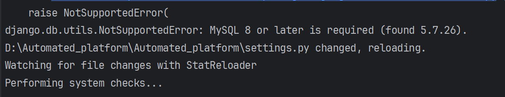
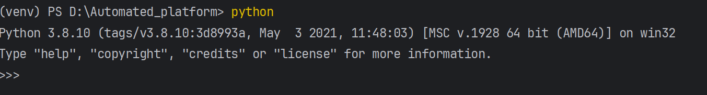
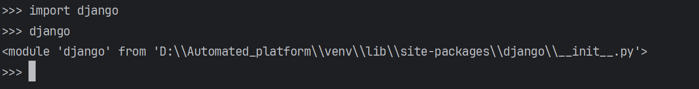
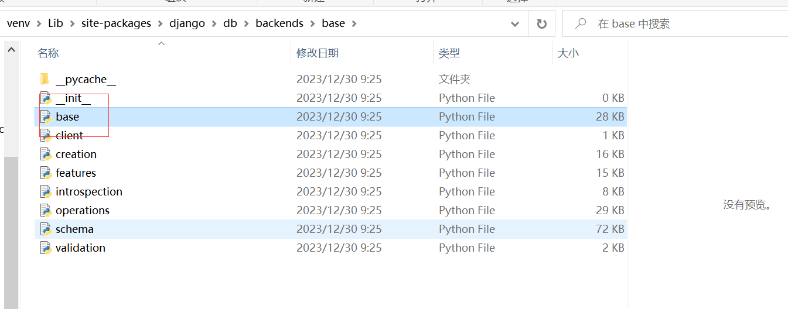
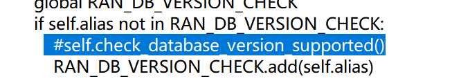
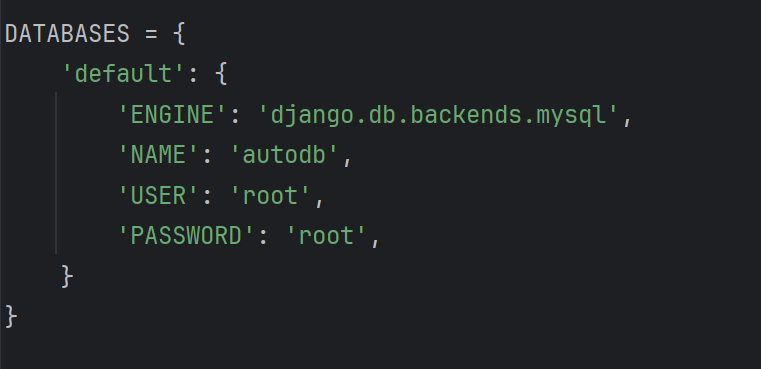
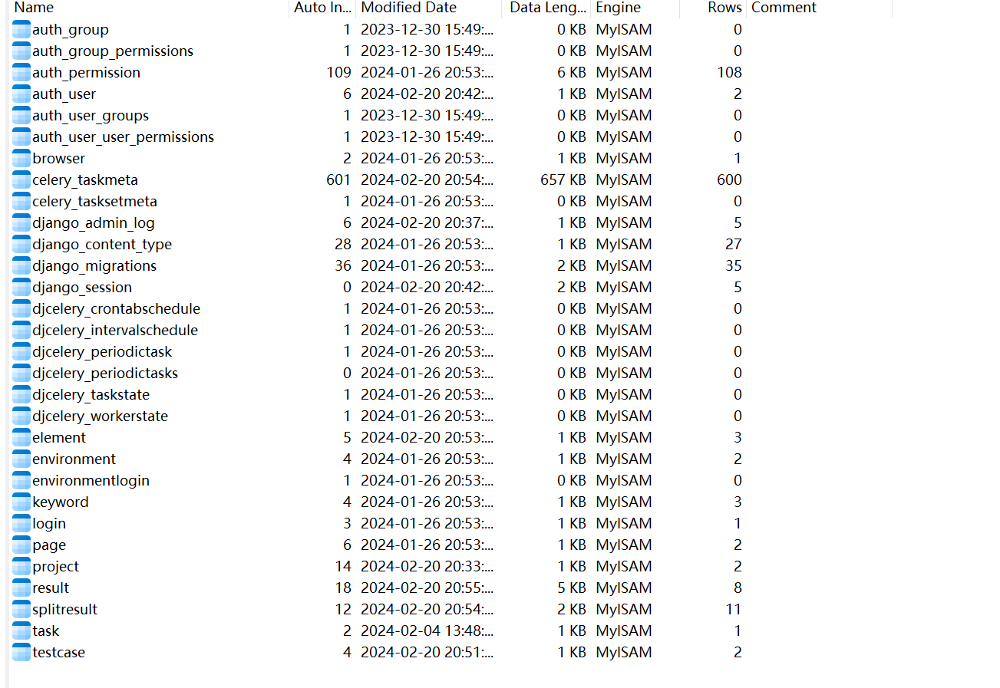
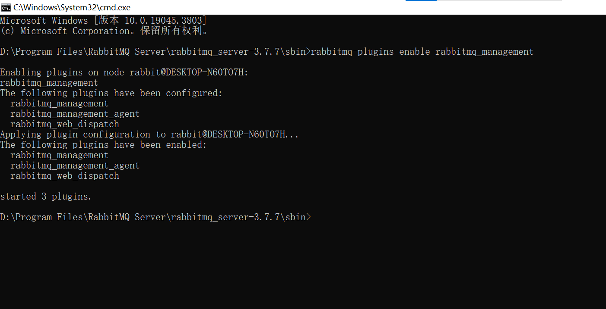

一、项目简介
Automated_platform 一款基于po模式的自动化测试平台,采用后端技术为Django+celery+RabbitMQ+mysql 配置mysql数据库，进行数据迁移后，运行项目后，即可成功访问http://127.0.0.1:8001/app/login/
后台管理系统:http://127.0.0.1:8001/admin/
这个端口号默认是8000，因为我的8000被其他项目占用了，所以我换成了8001，你们就用实际的端口号就可以。

二、部署流程
1、配置python解释器
建议选择python36,不容易出现问题，如果选择高版本python，则在后续会因为各包版本问题出现很多报错。 
2、下载requirements.txt中的依赖
可以单独下，也可以命令行直接下载，这个不会的可以去百度，如下载失败，就更换pip下载源，推荐清华源。 版本尽可能和我的一样，避免后续因版本问题出现报错
3、安装mysql数据库（没有安装的可以去百度搜索安装教程） 
settings.py中对数据库进行配置（换成你的用户名和密码，数据库名等参数） 版本选择5+

3、打开项目命令行进行数据迁移 
python manage.py makemigrations python manage.py migrate
如果安装了mysql，但是在运行项目出现版本不一致（版本低）的报错时，按如下步骤修改。

方法：打开终端命令行输入
(venv) PS D:\Automated_platform> python
Python 3.8.10 (tags/v3.8.10:3d8993a, May  3 2021, 11:48:03) [MSC v.1928 64 bit (AMD64)] on win32
Type "help", "copyright", "credits" or "license" for more information.
>>> import django 
>>> django
<module 'django' from 'D:\\Automated_platform\\venv\\lib\\site-packages\\django\\__init__.py'>
>>>

可以看到django所在目录
完整目录是D:\\Automated_platform\\venv\\lib\\site-packages\\django\db\backends\base 打开base目录下的base.py 找到self.check_database_version_supported()并注释掉

这样再次运行项目时就不会报错了
settings.py中对mysql的配置（全部改成自己的数据库和用户名密码）

迁移成功后可以看到新增了如下表 

4、Django创建超级用户
进入项目根目录，输入命令`python manage.py createsuperuser`，然后根据提示输入用户名、邮箱和密码
密码必须满足复杂性要求，通常至少为8个字符，包含大小写字母、特殊字符和数字的组合。如果命令执行失败，可能是因为没有在终端中运行命令，而是通过图形界面运行导致的错误。在这种情况下，可以尝试在终端中输入命令`python manage.py shell`，然后执行同样的`createsuperuser`命令。
创建成功后，可以使用新创建的超级用户账户登录到Django的管理后台，地址通常为`http://localhost:8000/admin`。在管理后台中，可以进行用户管理、权限管理等操作。

5、安装RabbitMQ
 首先下载与安装 erlang erlang
下载地址 http://www.erlang.org/downloads 下载后点击运行一直next即可。
下载RabbitMQ Github仓库
下载地址：https://github.com/rabbitmq/rabbitmq-server/releases/download/v3.7.7/rabbitmq-server-3.7.7.exe 安装过程很简单 直接next就行了
安装成功后我们开始配置RabbitMQ 进入rabbitmq安装目录sbin下 打开命令行运行以下命令 
rabbitmq-plugins enable rabbitmq_management 

出现以下内容代表成功

执行成功后 就可以打开浏览器访问localhost:15672 账号和密码为guest

6、执行异步任务/定时任务命令（项目根目录命令行输入）
python manage.py celeryd -l info # 启动 celery 异步执行测试案例 
python manage.py celerybeat -l info # 启动 celery 定时执行测试案例
